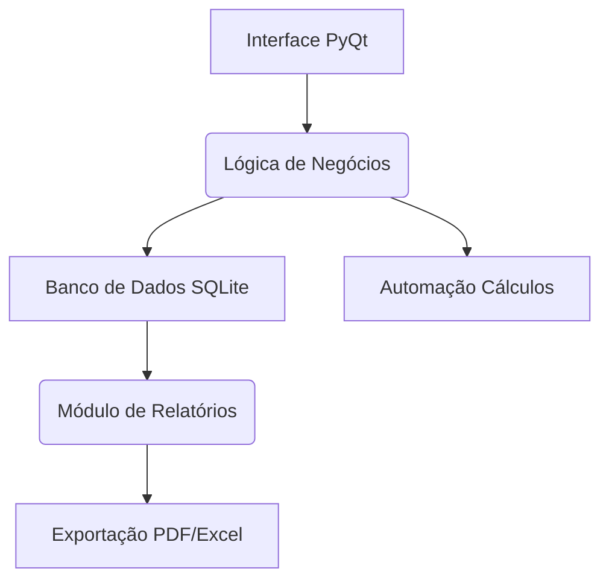

# Wenderson Lopes 👨‍💻  
### **Engenheiro de Software | Biólogo | Desenvolvedor Python Desktop**

<div align="center">
  
  [](https://www.python.org/)
  [](https://www.riverbankcomputing.com/software/pyqt/)
  [](https://www.sqlite.org/index.html)
  [](https://git-scm.com/)
  [](https://pandas.pydata.org/)

</div>

---

## 🧬 Formação Multidisciplinar  
Com **Licenciatura em Ciências Biológicas**, desenvolvi pensamento analítico e resolução sistêmica de problemas. Atualmente cursando **Engenharia de Software**, aplicando metodologias ágeis e boas práticas de desenvolvimento para criar soluções tecnológicas robustas.

---

## 🛠️ Habilidades Técnicas  
### Desktop Development Stack  

```python
class FerramentaGestao:
    def __init__(self):
        self.interface = PyQt6()
        self.dados = SQLModel()
        self.relatorios = PandasAnalyzer()
```

**GUI:** PyQt6, Tkinter, CustomTKinter

**Data Management:** SQLAlchemy, SQLite, PostgreSQL

**Core:** POO, Design Patterns, Clean Architecture

**Produtividade:** PyInstaller, Auto-py-to-exe, CI/CD

## 🚀 Projeto: GestorFolha - Ferramenta Desktop para RH
### 📌 Solução Empresarial Offline

**Funcionalidades-chave:**

✅ Cadastro centralizado de colaboradores

✅ Controle de ponto integrado

✅ Geração automática de folha pagamento

✅ Relatórios gerenciais em PDF/Excel

✅ Backup local criptografado

## 🔧 Arquitetura Técnica



## 🤝 Buscando Colaboradores!

**Oportunidades de contribuição:**

- Implementar sistema de crachás digitais

- Desenvolver integração com sistemas contábeis

- Criar módulo de avaliação de desempenho

- Otimizar processo de packaging (Windows/macOS/Linux)

**Como participar:**

1. Clone o repositório:

2. `git clone https://github.com/seuuser/gestorfolha-desktop.git`

3. Veja as issues marcadas como `good first issue`

4. Envie um PR com suas melhorias

# 📬 Conecte-se Comigo

Instagram: https://www.instagram.com/lopeswenderson.engsoft/

Linkedin: https://www.linkedin.com/in/wenderson-lopes-194444359

E-mail: dev.wendersonlopes@gmail.com

🔍 *"Combinando precisão científica com excelência técnica para revolucionar gestão de pessoas"* 🔍


